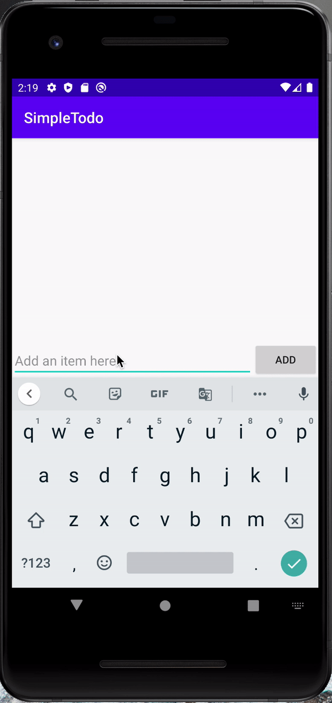
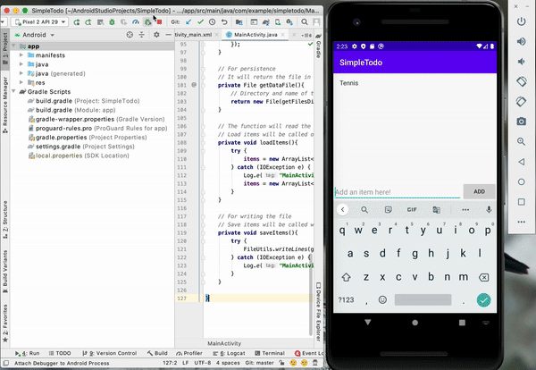
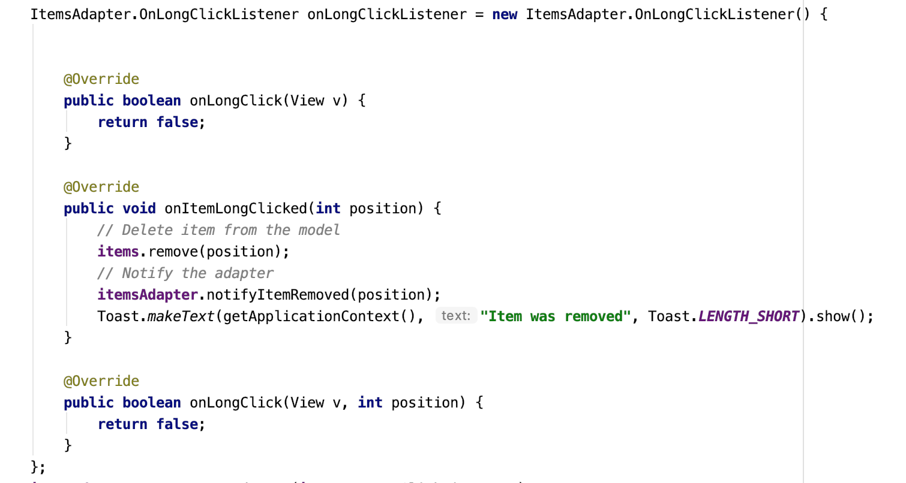

# CodePath Pre-work - *Simple ToDo*
**Simple Todo** is an android app that allows building a todo list and basic todo items management functionality including adding new items, editing and deleting an existing item.

Submitted by: Aishwarya Pothula

Time spent: 10-12 hours spent in total

##User Stories
The following **required** functionality is completed:

* [ ] User can **successfully add ** from the todo list
* [ ] User can **remove items ** from the todo list by long-clicking on the item
* [ ] User can **persist todo items** and retrieve them properly on app restart

## Working Log
Here's my [ working log ]( https://docs.google.com/document/d/1xoBIiz3JlWGRPyfQ9M7uWgfHPHodwiYug36crah_AGg/edit?usp=sharing ) while implementing the app 

## Next iterations
In the next iterations of the app, I will be implementing the following features
* [ ] Edit the text of an item added to the list
* [ ] Option to add reminders for the items
* [ ] Add deadlines and display time remaining till the deadline
* [ ] Option to add priority labels

## Video Walkthrough
Here's a walkthrough of implemented user stories
* [ ] Add and Delete item

* [ ] Persistence of list

GIF created with Ezgif.com

## Notes

* I was working with a different version (4.0.1) of Android Studio than the one being used in the tutorial
* I used "import org.apache.commons.io.FileUtils;" in place of "import android.os.FileUtils;" in MainActivity.java to get the readLines to work
* Had a problem with the Edit Text not being enabled after implementing the recycler view
  * After a lot of time, I realized that this was a layout problem; the recycler view is on top of the edit text
  * To resolve the issue, I set the layout_above attribute of the recycler to id/etItem
* Due to the version differences, I had to implement the following methods instead of just the 'onItemLongClicked'
  
  

  

